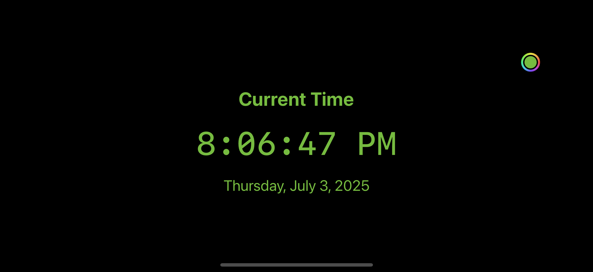
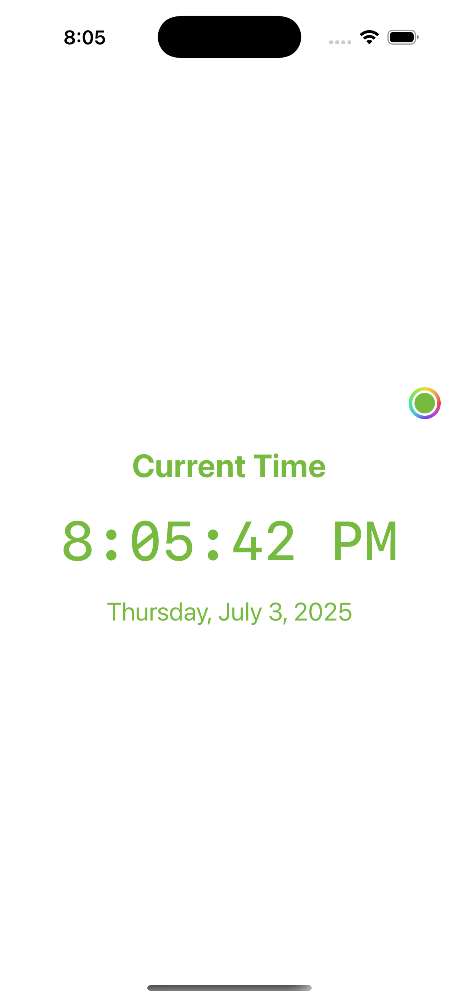
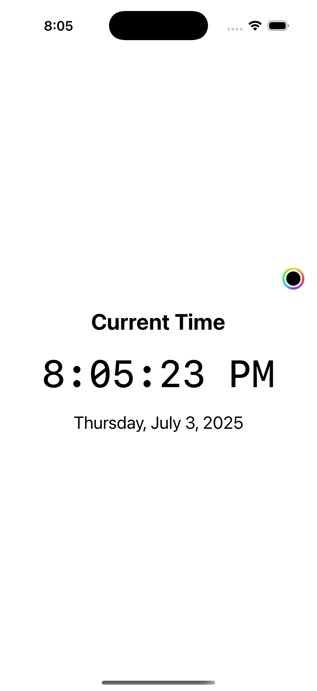

# TickTock Clock ⏰

A simple, elegant clock app that shows the current time and date, updating live every second. Users can customize the text color with an integrated color picker.

## ✨ Features

- Live digital clock with second updates.
- Current date displayed below the time.
- Fully supports portrait and landscape orientations.
- Color picker to let users set their preferred text color.
- Clean, minimal interface.

## 📱 Screenshots

  
